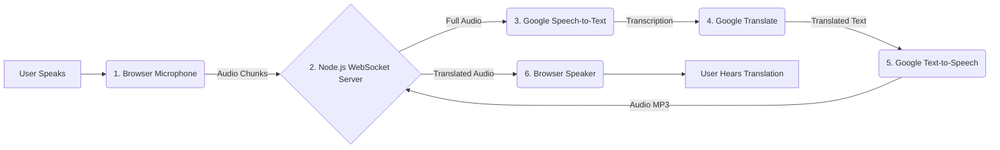

# Live Interpreter - Real-Time AI Translation

The **Live Interpreter** is a full-stack web application that provides real-time, AI-powered speech-to-speech translation. Speak in one language, and hear the translation in another almost instantly. This project leverages a suite of Google Cloud AI APIs to deliver a seamless and intuitive translation experience.

## Features

* **Real-Time Translation:** Captures microphone audio and provides spoken translations with minimal latency.
* **Multi-Language Support:** Easily configurable to translate between a wide variety of languages, including English, German, French, Spanish, Japanese, and more.
* **Intelligent Speech Detection:** Automatically detects when you stop speaking to process complete sentences, improving accuracy and naturalness.
* **Web-Based UI:** A clean and simple user interface for selecting languages, microphones, and viewing a live log of transcriptions and translations.
* **Scalable Backend:** Built with Node.js and WebSockets for efficient, real-time, two-way communication.
* **Containerized & Deployable:** Fully containerized with Docker, ready for easy deployment anywhere, from your local machine to the cloud.

## Architecture

The application works by orchestrating several services in a continuous flow:

1. **Audio Capture (Frontend):** An `AudioWorkletProcessor` captures microphone audio in the browser on a separate thread to keep the UI responsive. It sends raw audio chunks to the backend via a WebSocket.
2. **WebSocket Server (Backend):** A Node.js server receives the audio data. It buffers the audio until the frontend signals "end-of-speech."
3. **Speech-to-Text:** The complete audio buffer is sent to the **Google Cloud Speech-to-Text API**, which returns a transcription.
4. **Translation:** The transcription text is sent to the **Google Cloud Translation API** to be translated into the target language.
5. **Text-to-Speech:** The translated text is sent to the **Google Cloud Text-to-Speech API**, which generates an audio file (MP3) of the spoken translation.
6. **Audio Playback (Frontend):** The generated audio is sent back to the browser over the WebSocket, where it is queued and played aloud.



## Setup and Configuration

### Prerequisites

* **Node.js** (v18 or later)
* **Docker Desktop** installed and running.
* A **Google Cloud Platform (GCP) Project** with billing enabled.

### 1. Google Cloud Project Setup

Before running the application, you need to configure your GCP project and create a service account.

1. **Enable APIs:** In the GCP Console, go to "APIs & Services" and enable the following APIs:
   * `Cloud Speech-to-Text API`
   * `Cloud Translation API`
   * `Cloud Text-to-Speech API`

2. **Create a Service Account:**
   * Go to "IAM & Admin" > "Service Accounts".
   * Click "Create Service Account".
   * Give it a name (e.g., `live-interpreter-sa`).
   * Grant it the following roles:
     * `Cloud Speech-to-Text User`
     * `Cloud Translation API User`
     * `Cloud Text-to-Speech User`

3. **Create a Service Account Key:**
   * After creating the service account, go to its "Keys" tab.
   * Click "Add Key" -> "Create new key".
   * Select **JSON** and click "Create". A JSON key file will be downloaded.
   * **⚠️ Important:** Treat this file like a password. Do not commit it to version control. Rename it to `keyfile.json` and place it in the project root (it is already included in `.gitignore`).

### 2. Environment Variables

The application is configured using environment variables. Create a `.env` file in the project root or set these variables in your deployment environment.

```
# The ID of your Google Cloud project
GOOGLE_CLOUD_PROJECT="your-gcp-project-id"

# The path to your service account key file *inside the container*
# The default in the docker run command is /app/keyfile.json
GOOGLE_APPLICATION_CREDENTIALS="/app/keyfile.json"

# The port the application will run on
PORT="8080"
```

## Running the Application

This application is designed to be run as a Docker container.

### 1. Build the Docker Image

From the project's root directory, run the following command:
```bash
docker build -t live-interpreter .
```

### 2. Run the Container Locally

Use this command to run the application on your local machine. This command mounts your `keyfile.json` into the container and sets the necessary environment variables.
```bash
docker run --rm \
  -p 8080:8080 \
  -v "$(pwd)/keyfile.json":/app/keyfile.json \
  -e GOOGLE_APPLICATION_CREDENTIALS="/app/keyfile.json" \
  -e GOOGLE_CLOUD_PROJECT="your-gcp-project-id" \
  -e PORT="8080" \
  live-interpreter
```
*Replace `your-gcp-project-id` with your actual GCP Project ID.*

Once running, open your browser and navigate to **http://localhost:8080**.

## How to Use the App

1. **Open the Application:** Navigate to the application URL.
2. **Select Languages:** Choose the language you will be speaking in ("From") and the language you want to hear the translation in ("To").
3. **Select Microphone:** Choose your preferred input device from the microphone list.
4. **Start:** Click the "Start Interpretation" button. Your browser will ask for microphone permission.
5. **Speak:** The status will change to "Listening...". Speak clearly into your microphone. The green indicator will light up when it detects sound.
6. **Pause:** When you pause, the system will process what you said.
7. **Listen:** The translated audio will play back automatically. The original and translated text will appear in the log.
8. **Stop:** Click "Stop Interpretation" to end the session.

## License

This project is licensed under the MIT License. See the [LICENSE](LICENSE) file for details.

